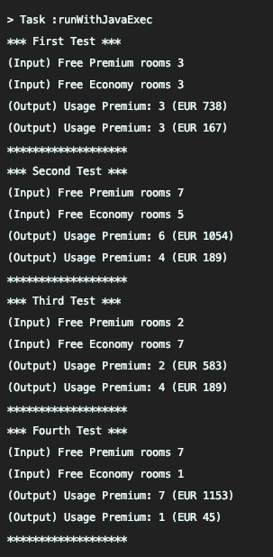

# Room occupancy Manager - Algorithm Only Project

The role of this sample project is to be build a room occupancy manager algorithm for SmartHost based on their requirements.

## Some screenshots of the project

<div align="center">
    
</div>

## How to run the project

1. Just make sure that you have Java and Gradle installed properly.
2. Run './gradlew runWithJavaExec'
3. That's all folks!

#### Notes

* The data model is not entirely used in this sample app (Hotel domain class, Customer domain class etc...) However, it is the model that I will rely on in the REST API Implementation using Spring Boot/Postgres.
* The ids of the domain classes are simple Strings for simplicity. In the Spring Boot project, I may use UUIDs or maybe auto-generated auto-incremented ids.

### License

```
Copyright (c) 2021 Fadi William Ghali Abdelmessih<fadi.william.ghali@gmail.com>

Permission is hereby granted, free of charge, to any person obtaining a
copy of this software and associated documentation files (the "Software"), to deal
in the Software without restriction, including without limitation the rights to use,
copy, modify, merge, publish, distribute, sublicense, and/or sell copies of the Software,
and to permit persons to whom the Software is furnished to do so, subject to the following
conditions:

The above copyright notice and this permission notice shall be included in all copies
or substantial portions of the Software.

THE SOFTWARE IS PROVIDED "AS IS", WITHOUT WARRANTY OF ANY KIND, EXPRESS OR IMPLIED,
INCLUDING BUT NOT LIMITED TO THE WARRANTIES OF MERCHANTABILITY, FITNESS FOR A PARTICULAR
PURPOSE AND NONINFRINGEMENT. IN NO EVENT SHALL THE AUTHORS OR COPYRIGHT HOLDERS BE LIABLE
FOR ANY CLAIM, DAMAGES OR OTHER LIABILITY, WHETHER IN AN ACTION OF CONTRACT, TORT OR
OTHERWISE, ARISING FROM, OUT OF OR IN CONNECTION WITH THE SOFTWARE OR THE USE OR OTHER
DEALINGS IN THE SOFTWARE.
```
